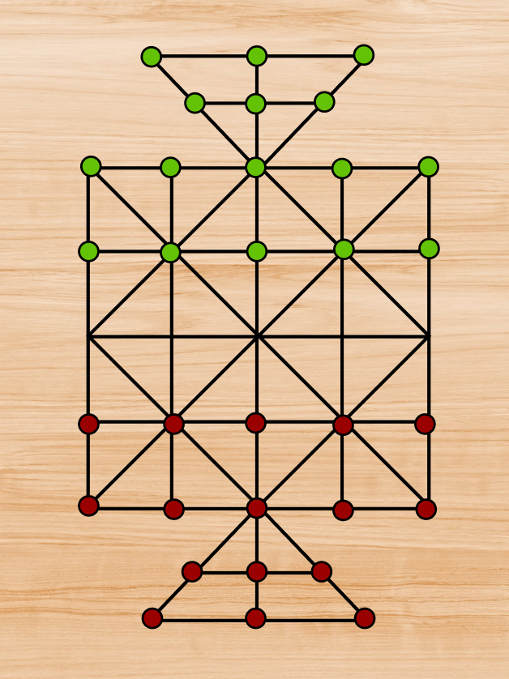

# 16-Ghuti-Modified-Rules-Game
<h1>Introduction</h1>

Sholo Ghuti is very famous two player board game in South- East Asia specifically in India, Bangladesh, Pakistan, Indonesia, Sri Lanka and Nepal. 
Each players has 16 beads called Ghuti. The player who captures all the 16 pieces of opponent wins the game.

 
<h2>Basic Concept</h2>
<ul>
	<li>Initially each player will start with 16 beads.</li>
	<li>In each turn a player must make a move of one of his beads.</li>
	<li>He can make a simple move or perform one or more capture but not both.</li>
	<li>A bead may move onto vacant adjacent point along a line. </li>
	<li>Players alternate their turns.</li>
	<li>A piece may capture an opposing adjacent piece by a single leap and leap over it onto an immediate vacant point.</li>
	<li>The captured pieces are removed from the board.</li>
	<li>The player who captures all the 16 pieces of opponent wins the game. </li>
</ul>

 
Figure: Basic Board and Initial Arrangement

 
Figure: Capture Example

<h2>Modified Rules in This Sholo Ghuti Game</h2>
<ul>
	<li>We added 2 more triangle with 6 slots to the right and the left of the board</li>
	<li>We also added 2 extra rows on each side of the board (total 4 extra rows). One of the rows consists of 9 slots and other one consists of 7 slots.</li>
	<li>Initially the Beads(pieces) will be placed on the newly added extra 2 rows. Let us call the newly added rows as Stationary Rows</li>
	<li>From the Stationary Rows a bead can be move to any free slot of the board.</li>
	<li>In the stationary row the bead which is loacted to the leftmost can only move</li>
	<li>A bead can not be bring back to stationary row from main board and also a bead can not be moved within the stationary rows</li>
	<li>Once a bead is placed on the main board it will folow the normal rules of sholo ghuti</li>
</ul>

 
Figure: Modified Board with Initial Arrangement

<h2>AI Development</h2>

Initially we had used minimax algorithm to develop our AI but when the search depth was 3 or more it was very slow. To optimize our algorithm we used pruning method. 
The Minimax Pruning or Alpha Beta Pruning is an optimized version of normal Minimax algorithm. In Alpha Beta Pruning it decreases the number of nodes that are evaluated by the minimax algorithm in its search tree. 

If you want learn more about Minimax Algorithm and Alpha Beta Pruning check out the links given below:

<ul>
	<li><a href = "https://www.geeksforgeeks.org/minimax-algorithm-in-game-theory-set-1-introduction/">GeeksforGeeks - Minimax Algorithm</a></li>
	<li><a href = "">GeeksforGeeks - Alpha-Beta Pruning </a></li>
	<li><a href = "https://www.mygreatlearning.com/blog/alpha-beta-pruning-in-ai/">Alpha Beta Pruning in AI</a></li>
</ul>
 